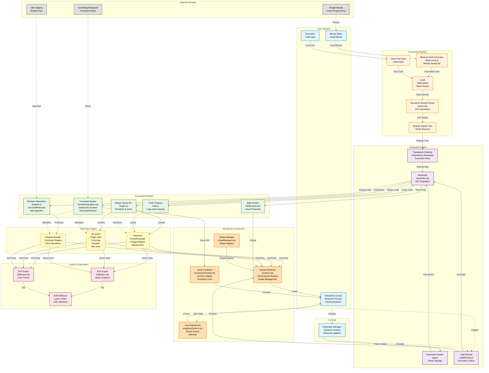

<h2 align="center">Otto: Teaching Parametric Design in Digital Fabrication Education</h2>

  <picture>

  </picture>

  <b>A graphical programming language for parametric design education</b>

  <a href="https://github.com/HisarCS/Aqui/tree/main/Docs">Documentation</a> •
  <a href="https://github.com/HisarCS/Aqui/blob/main/LICENSE">License</a> 

---
Graphical programming language mainly created for teaching Parametric designing in digital fabrication education while promoting computational thinking skills as well. It is completely **OPEN SOURCE!** contact EmreDay1 if you want to contribute send an email to emre.dayangac@hisarschool.k12.tr, emreday01@gmail.com, sedat.yalcin@hisarschool.k12.tr and if you want to contact the organization you may email hisarcs@hisarschool.k12.tr

The AQUI language for Otto was mainly built to create a more engaging environment for the Parametrix project. The language's main goal is to provide a more in-depth editing capability for users, trying to learn Parametric designing with Parametrix, the language was completely written in JavaScript, and is a graphical language to create Parametrix designs. AQUI is an interpreted language. If you want to learn how to use it, it's inner workings here is the documentation link: https://github.com/HisarCS/Aqui/tree/main/Docs

# Otto System Architecture

